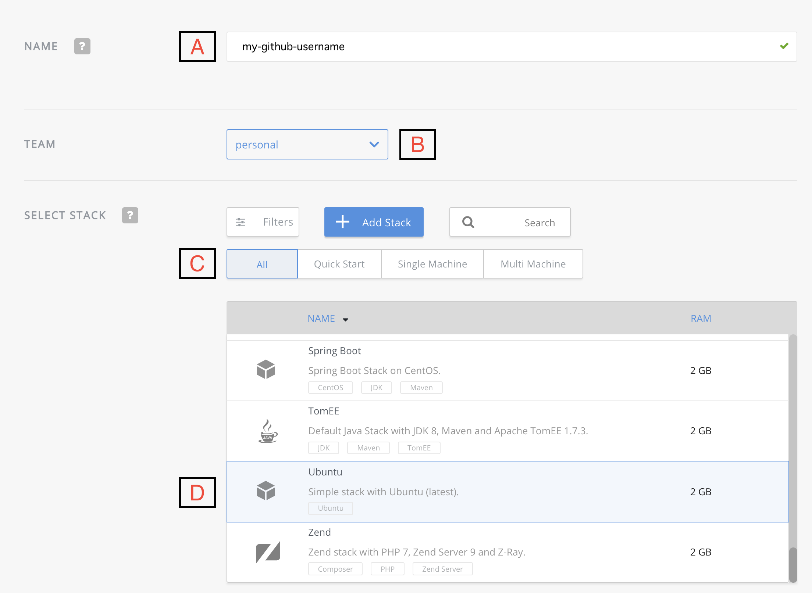
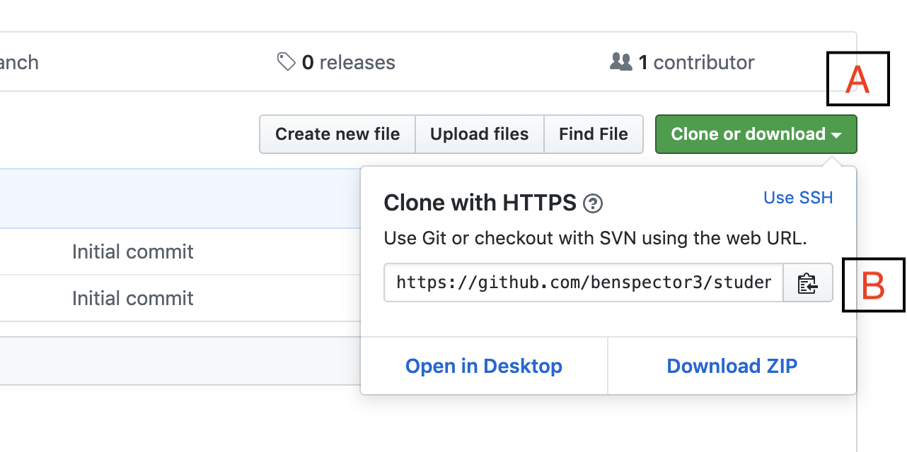
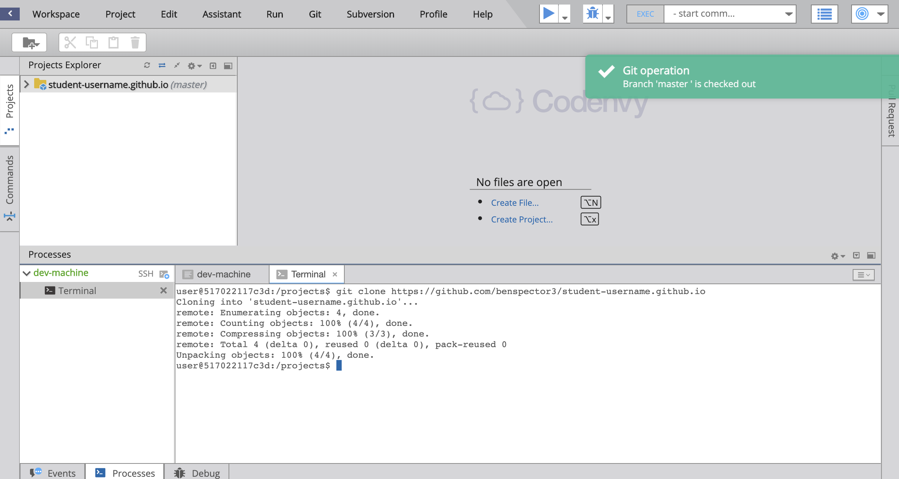
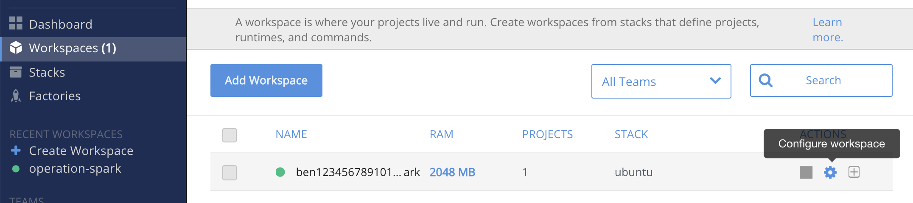
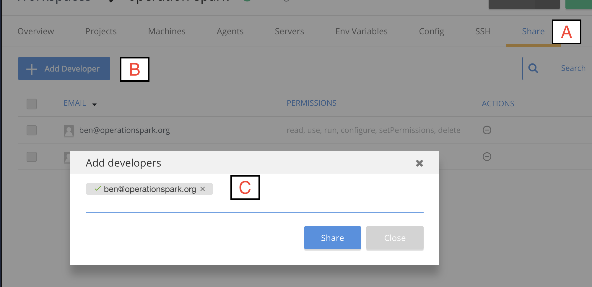

## Setup

## Sign-in to Required Accounts

1. Sign into GitHub: <a href="https://github.com/login" target="_blank">Github</a>
2. Sign into Codenvy: <a href="https://codenvy.io/site/login" target="_blank">Codenvy</a>

## Creating a New GitHub Repo For Your Site

GitHub will host a website for each user and organization for free.  The feature is called <a href="https://pages.github.com/" target="_blank">GitHub Pages</a>.

The first thing we need to do is create a new repository on GitHub and name it using the following naming pattern:

    yourusername.github.io

Click here to open a new browser tab and create create a new GitHub repository:
<a href="https://github.com/new" target="_blank">Right Click --> Open Link In New Tab </a>.

NOTE: If you're not signed-in to GitHub, you might see a web page that says 404 (This is not the web page you are looking for).  Just sign-in to GitHub on this page and you will be forward to the _create new repository_ page.

Follow these steps and see the screenshot below to create a new repository.

**Click to enlarge image**


1. On the Create New Repository page, in the box for **Repository name**, name the repository like:

    `your-github-username.github.io`
    
    replacing `your-github-username` with you actual GitHub username.  MAKE SURE your username is spelled correctly, otherwise you'll have problems **(See A)**.
    

2. Enter a description for your repository in the **Description** box, like `My own awesome website!' **(See B)**.

3. Select the **Public** radio button to allow anyone to see this repository **(See C)**.

4. Check the **Initialize this repository with a README** box **(See D)**.

5. Click the **Add .gitignore** button, and Search for "Node". Click on "Node" from the dropdown. **(See E)**.
    
6. Double check that you have followed these instructions properly. Then click **Create Repository** **(See F)**.

Awesome, you created your repository!

## Creating a Codenvy Workspace for our Website Project

GitHub is where we store and version our code. Codenvy is where we edit our code.  Codenvy is web-based set of tools for creating software.  By working in the cloud, our projects workspace is independent from any one computer. 

Follow these steps and see the screenshot below to create a new workspace.



1. Sign into Codenvy.io
2. On the left sidebar of your Codenvy Dashboard, go to "Workspaces". Click on "Add Workspace"
3. When creating a new workspace make sure to enter these fields as follows:

    A) Name: "operation-spark"
    
    B) Team: "personal"
    
    C) Select Stack: All
    
    D) Scroll down until you find "Ubuntu"
    
Once you have followed these steps you can create your workspace. This may take a moment so while it gets set up we can clone our repository from Github.

## Cloning repository from Github to Codenvy Workspace

Next step, we need to _clone_ our repository into our Codenvy workspace, where we will do our work.  After creating the repository on GitHub, you'll be brought to the repository's default view.  

**Return to github.com**

 

1.  In the top right corner of the screen, you will want to:
    
    A) Click Clone or download (See A). Make sure that "Clone with HTTPS" appears in the top right corner of the dropdown box.
    
    B) Click the "Copy URL to clipboard" button (See B).

**Return to your newly created Codenvy workspace**

 

2. **(See B)** Clone your Github repository into your Codenvy workspace by typing this command into the terminal at the bottom of your workspace (replace `"my-github-url.github.io"` with your own Github url by pasting the link that you copied from step 1):

```
git clone "my-github-url.github.io`
```

or use the line below if you are using self-signed SSL

```
GIT_SSL_NO_VERIFY=true git clone my-github.github.io
```

3. You should now have your Github repository downloaded into your workspace **(See A)**

4. The next step requires us to "change directory" to the folder (also known as a _directory_) you just created. In the terminal at the bottom of your workspace, enter this command and replace `my-github-username.github.io` with the name of the folder you just created **(See B)**:

```
cd my-github-username.github.io
```


4. Then, we need to setup some github information. In your bash terminal enter these commands (Substitute with the email you used to setup Github and your Github username):

```
git config user.email "my-github-email@gmail.com"
git config user.name "my-github-username"
```

## Share your workspace

1. On the left side of your Codenvy sidebar, click on "Workspaces"



2. Next to your workspace, click on the Gear icon **(See Above)**



3. Go to the "Share" tab **(See A)**

4. Click on "Add Developer" **(See B)**

5. Enter the email of your instructor **(See C)**. Make sure you see a green check-mark by their email.

6. Share your workspace with your instructor.

## Install `opspark` tool

1. Enter this command:

`curl https://raw.githubusercontent.com/creationix/nvm/v0.25.0/install.sh | bash`

2. Close your terminal. Select **Run** from the top Menu. Click on **Terminal**

3. Back in your terminal, enter these commands:

```
nvm install 8
nvm alias default 8
npm install -g opspark
os login
```

4. When prompted, enter your Github username and password.
