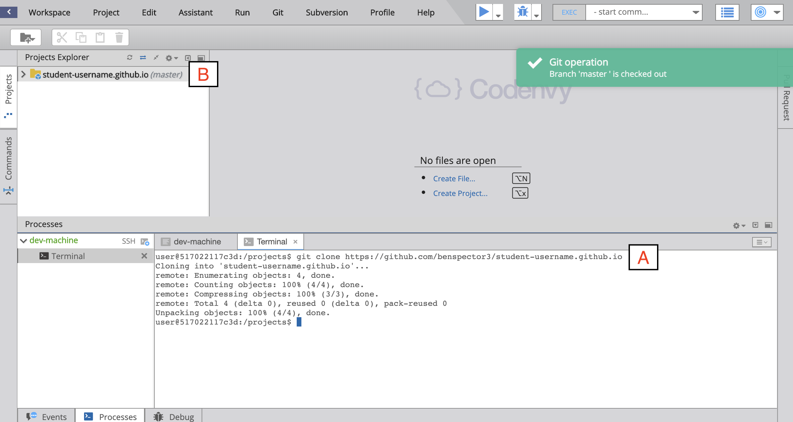

**Table of Contents**

- [Github](#github)
    - [Creating a New GitHub Repository](#creating-a-new-github-repository)
- [Codenvy](#codenvy)
    - [Creating a Codenvy Workspace](#creating-a-codenvy-workspace)
    - [Share your Codenvy Workspace](#share-your-codenvy-workspace)
    - [Install `opspark` tool](#install-opspark-tool)
    - [Cloning a repository from Github](#cloning-a-repository-from-github)
- [Offline Setup](#offline-setup)
    - [VS Code](#vs-code)

# Github

Create an account on GitHub: <a href="https://github.com/login" target="_blank">Click Here</a>

Github is a Source Control Manager (**S.C.M.**) that makes it incredibly easy to save our code online and periodically release new versions of our programs.

Additionally, GitHub will host a website for each user and organization for free. The feature is called <a href="https://pages.github.com/" target="_blank">GitHub Pages</a>. Each website hosted on Github Pages must adhere to this naming pattern naming pattern:

    yourusername.github.io

The code for this website will be stored in a **Repository** of the same name. A repository is just another name for a Folder for code. 

## Creating a New GitHub Repository

Click here to open a new browser tab and create create a new GitHub repository:
<a href="https://github.com/new" target="_blank">Right Click --> Open Link In New Tab </a>.

### NOTE: If you're not signed-in to GitHub, you might see a web page that says 404 (This is not the web page you are looking for).  Just sign-in to GitHub on this page and you will be forwarded to the _create new repository_ page.

Follow these steps and see the screenshot below to create a new repository.

**Click to enlarge image**


1. On the Create New Repository page, in the box for **Repository name**, name the repository like:

    `your-github-username.github.io`
    
    replacing `your-github-username` with you actual GitHub username.  MAKE SURE your username is spelled correctly, otherwise you'll have problems **(See A)**.
    

2. Enter a description for your repository in the **Description** box, like `My own awesome website!' **(See B)**.

3. Select the **Public** radio button to allow anyone to see this repository **(See C)**.

4. Check the **Initialize this repository with a README** box **(See D)**.

5. Click the **Add .gitignore** button, and Search for "Node". Click on "Node" from the dropdown. **(See E)**.
    
6. Double check that you have followed these instructions properly. Then click **Create Repository** **(See F)**.

Awesome, you created your repository!

# Codenvy

Create an Account on Codenvy: <a href="https://codenvy.io/site/login" target="_blank">Click Here</a>

IDEs (**I**ntegrated **D**evelopment **E**nvironments) are software tools that help us create files, write code, and edit code. IDEs are like Microsoft Word for creating program files. 

Codenvy is a cloud-based IDE which allows us to program anywhere we have internet! The tradeoff is that it may be a bit slower than an IDE that runs on your own machine, like VS Code.

## Creating a Codenvy Workspace

Follow these steps and see the screenshot below to create a new workspace.


1. Sign into Codenvy.io
2. On the left sidebar of your Codenvy Dashboard, go to "Workspaces". Click on "Add Workspace"
3. When creating a new workspace make sure to enter these fields as follows:

    A) Name: enter your own Github username
    
    B) Team: "personal"
    
    C) Select Stack: All
    
    D) Scroll down until you find "Ubuntu"
    
Once you have followed these steps you can create your workspace. This may take a moment so while it gets set up we can clone our repository from Github.

## Share your Codenvy Workspace

1. On the left side of your Codenvy sidebar, click on "Workspaces"


2. Next to your workspace, click on the Gear icon **(See Above)**


3. Go to the "Share" tab **(See A)**

4. Click on "Add Developer" **(See B)**

5. Enter the email of your instructor **(See C)**. Make sure you see a green check-mark by their email.

6. Share your workspace with your instructor.

## Install `opspark` tool

1. Enter this command:

`curl https://raw.githubusercontent.com/creationix/nvm/v0.25.0/install.sh | bash`

2. Close your terminal. Select **Run** from the top Menu. Click on **Terminal**

3. Back in your terminal, enter these commands:

```
nvm install 8
nvm alias default 8
npm install -g opspark
os login
```

4. When prompted, enter your Github username and password.

## Cloning a repository from Github

Next step, we need to _clone_ our repository into our Codenvy workspace, where we will do our work.  After creating the repository on GitHub, you'll be brought to the repository's default view.  

**Return to github.com**

 

1.  In the top right corner of the screen, you will want to:
    
    A) Click Clone or download (See A). Make sure that "Clone with HTTPS" appears in the top right corner of the dropdown box.
    
    B) Click the "Copy URL to clipboard" button (See B).

**Return to your newly created Codenvy workspace**

 

2. **(See B)** Clone your Github repository into your Codenvy workspace by typing this command into the terminal at the bottom of your workspace (replace `"my-github-url.github.io"` with your own Github url by pasting the link that you copied from step 1):

```
git clone "my-github-url.github.io`
```

or use the line below if you are using self-signed SSL

```
GIT_SSL_NO_VERIFY=true git clone my-github.github.io
```

3. You should now have your Github repository downloaded into your workspace **(See A)**

4. The next step requires us to "change directory" to the folder (also known as a _directory_) you just created. In the terminal at the bottom of your workspace, enter this command and replace `my-github-username.github.io` with the name of the folder you just created **(See B)**:

```
cd my-github-username.github.io
```


4. Then, we need to setup some github information. In your bash terminal enter these commands (Substitute with the email you used to setup Github and your Github username):

```
git config user.email "my-github-email@gmail.com"
git config user.name "my-github-username"
```

# Offline Setup

NOTE: If you are working on a Windows computer, you must install these 2 pieces of software before moving on:

Node: <a href=https://nodejs.org/en/download> Right Click --> Open in new tab </a>
Git: <a href=https://git-scm.com/download> Right Click --> Open in new tab </a>

## VS Code

Download VS Code: <a href=https://code.visualstudio.com/download target=_blank> Click Here </a>

IDEs (**I**ntegrated **D**evelopment **E**nvironments) are software tools that help us create files, write code, and edit code. IDEs are like Microsoft Word for creating program files. 

VS Code is a free IDE created by Microsoft that is used by professional programmers around the world. Compared to cloud-based IDEs, VS Code runs locally on the machine it is installed on. The benefit is that it is much faster and is limited by the power of the computer, rather than the amount of CPU purchased from the IDE provider. 

The drawback is that you need your own computer to program. However, with the use of Github, this can be avoided since Github creates an online backup of your code which can be accessed anywhere with an internet connection. 


